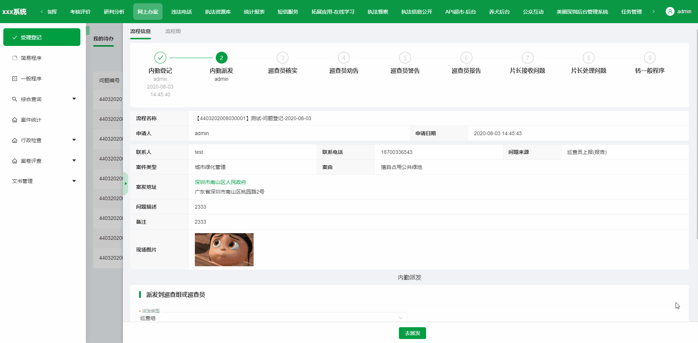
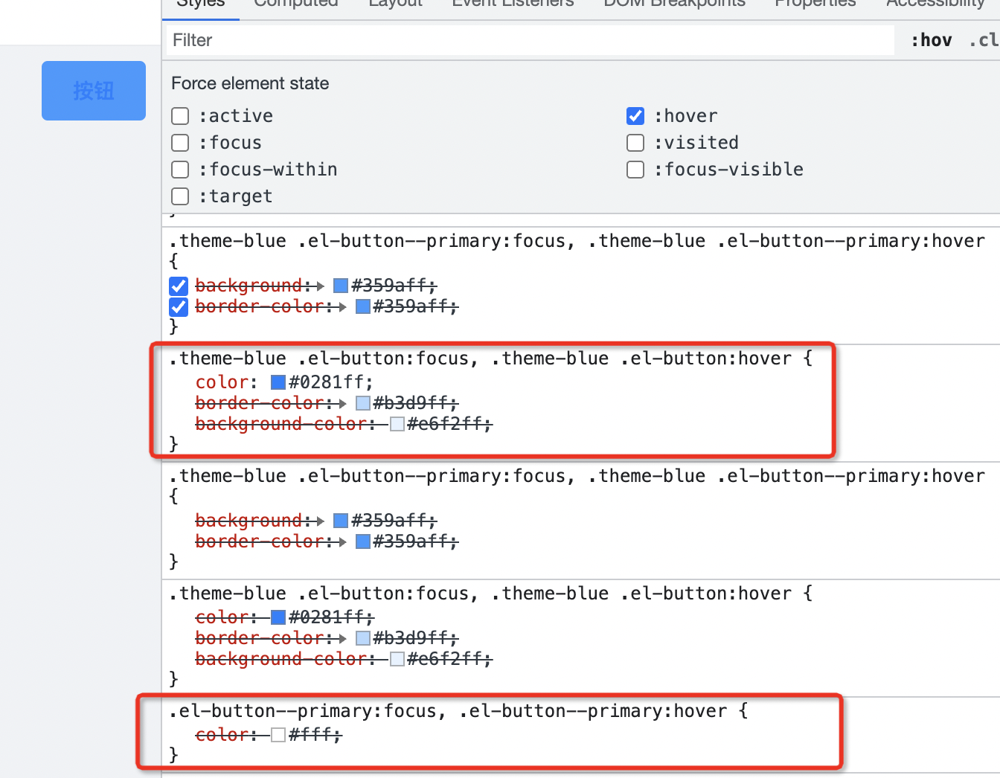
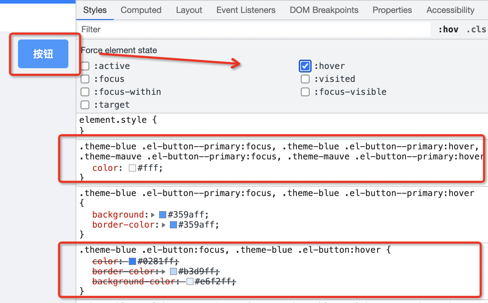

# @zougt/vite-plugin-theme-preprocessor

一个[vite v2.0+](https://cn.vitejs.dev/)插件，用于实现多个 `less`、`sass` 变量文件编译出多主题的 css

使得基于`less`、`sass`以及`css modules`的主题样式在线动态切换变得很简单

使用了插件钩子：

- config
- configResolved
- buildStart
- generateBundle
- transformIndexHtml

核心功能是 [@zougt/some-loader-utils](https://github.com/GitOfZGT/some-loader-utils)提供的 `getLess` 和 `getSass` ，目前没有 `stylus`的需求

- [getLess](https://github.com/GitOfZGT/some-loader-utils#getLess)，本质上是对[less 包](https://github.com/less/less.js)的扩展
- [getSass](https://github.com/GitOfZGT/some-loader-utils#getSass)，本质上是对[sass 包](https://github.com/sass/dart-sass)的扩展

## 案例效果图



## 安装与使用

```bash
# use npm
npm install @zougt/vite-plugin-theme-preprocessor -D
# use yarn
yarn add @zougt/vite-plugin-theme-preprocessor -D
```

**vite.config.js**

```js
import themePreprocessorPlugin from "@zougt/vite-plugin-theme-preprocessor";
export default {
  plugins: [
    themePreprocessorPlugin({
      scss: {
        // 预处理器的变量文件
        multipleScopeVars: [
          {
            scopeName: "theme-default",
            path: path.resolve("src/theme/default-vars.scss"),
          },
          {
            scopeName: "theme-mauve",
            path: path.resolve("src/theme/mauve-vars.scss"),
          },
        ],
        // 默认取 multipleScopeVars[0].scopeName
        defaultScopeName: "",
        // 在生产模式是否抽取独立的主题css文件，extract为true以下属性有效
        extract: true,
        // 独立主题css文件的输出路径，默认取 viteConfig.build.assetsDir 相对于 (viteConfig.build.outDir)
        outputDir: "",
        // 会选取defaultScopeName对应的主题css文件在html添加link
        themeLinkTagId: "theme-link-tag",
        // "head"||"head-prepend" || "body" ||"body-prepend"
        themeLinkTagInjectTo: "head",
        // 是否对抽取的css文件内对应scopeName的权重类名移除
        removeCssScopeName: false,
        // 可以自定义css文件名称的函数
        customThemeCssFileName: (scopeName) => scopeName,
      },
      // less: {
      //   multipleScopeVars: [
      //     {
      //       scopeName: "theme-default",
      //       path: path.resolve("src/theme/default-vars.less"),
      //     },
      //     {
      //       scopeName: "theme-mauve",
      //       path: path.resolve("src/theme/mauve-vars.less"),
      //     },
      //   ],
      // },
    }),
  ],
};
```

## 多主题编译示例（以 sass 为例）

```scss
//src/theme/default-vars.scss
/**
*此scss变量文件作为multipleScopeVars去编译时，会自动移除!default以达到变量提升
*同时此scss变量文件作为默认主题变量文件，被其他.scss通过 @import 时，必需 !default
*/
$primary-color: #0081ff !default;
```

```scss
//src/theme/mauve-vars.scss
$primary-color: #9c26b0;
```

```scss
//src/components/Button/style.scss
@import "../../theme/default-vars";
.un-btn {
  position: relative;
  display: inline-block;
  font-weight: 400;
  white-space: nowrap;
  text-align: center;
  border: 1px solid transparent;
  background-color: $primary-color;
  .anticon {
    line-height: 1;
  }
}
```

编译之后

src/components/Button/style.css

```css
.un-btn {
  position: relative;
  display: inline-block;
  font-weight: 400;
  white-space: nowrap;
  text-align: center;
  border: 1px solid transparent;
}
.theme-default .un-btn {
  background-color: #0081ff;
}
.theme-mauve .un-btn {
  background-color: #9c26b0;
}
.un-btn .anticon {
  line-height: 1;
}
```

### 并且支持 Css Modules

对于`*.module.scss`，得到的 css 类似：

```css
.src-components-Button-style_un-btn-1n85E {
  position: relative;
  display: inline-block;
  font-weight: 400;
  white-space: nowrap;
  text-align: center;
  border: 1px solid transparent;
}
.theme-default .src-components-Button-style_un-btn-1n85E {
  background-color: #0081ff;
}
.theme-mauve .src-components-Button-style_un-btn-1n85E {
  background-color: #9c26b0;
}
.src-components-Button-style_un-btn-1n85E
  .src-components-Button-style_anticon-1n85E {
  line-height: 1;
}
```

## 在线切换主题 css 文件

```js
import { toggleTheme } from "@zougt/vite-plugin-theme-preprocessor/dist/browser-utils.js";

toggleTheme({
  scopeName: "theme-default",
  // 可选，看情况用， link的href处理，生产模式下都可用， 当启用 themePreprocessorPlugin 的 extract后才需要
  // customLinkHref: (href) => href,
  // 可选，默认对应 themePreprocessorPlugin 的 themeLinkTagId
  // themeLinkTagId: "theme-link-tag",
  // 可选 "head" || "body"
  // themeLinkTagInjectTo: "head",
  //可填可不填， 对应 themePreprocessorPlugin 的 multipleScopeVars
  // multipleScopeVars
});
```

### multipleScopeVars[].includeStyles

Type: `Object`

当存在以下情况时，可以用这个属性处理

```css
.theme-blue .el-button:focus,
.theme-blue .el-button:hover {
  /*这里的color值由 $primary-color 编译得来的，所以选择器前面加了 .theme-blue 提高了权重*/
  color: #0281ff;
  border-color: #b3d9ff;
  background-color: #e6f2ff;
}
.el-button--primary:focus,
.el-button--primary:hover {
  /*这里的color值不是由 变量 编译得来的，这时就会被上面那个 color 覆盖了， 实际上这里的color才是需要的效果*/
  color: #fff;
}
```

```js
const includeStyles = {
  ".el-button--primary:hover, .el-button--primary:focus": {
    color: "#FFFFFF",
  },
};
const multipleScopeVars = [
  {
    scopeName: "theme-default",
    path: path.resolve("src/theme/default-vars.less"),
    includeStyles,
  },
  {
    scopeName: "theme-mauve",
    path: path.resolve("src/theme/mauve-vars.less"),
    includeStyles,
  },
];
```

得到

```css
.theme-blue .el-button:focus,
.theme-blue .el-button:hover {
  /*这里的color值由 $primary-color 编译得来的，所以选择器前面加了 .theme-blue 提高了权重*/
  color: #0281ff;
  border-color: #b3d9ff;
  background-color: #e6f2ff;
}
.theme-blue .el-button--primary:focus,
.theme-blue .el-button--primary:hover {
  /*这里的color值不是由 变量 编译得来的，通过includeStyles也提高了权重得到实际的效果*/
  color: #ffffff;
}
```

出现权重问题效果图



使用了 includeStyles 的效果图



webpack 版本的实现方案请查看[`@zougt/some-loader-utils`](https://github.com/GitOfZGT/some-loader-utils#getSass)

## resetStylePreprocessor

> 注：由于 vite 内置 css 插件未提供外接`less`、`sass`的口子(类似[`webpack-contrib/less-loader`](https://github.com/webpack-contrib/less-loader)的`implementation`)，在`@zougt/vite-plugin-theme-preprocessor`的 buildStart 内替换了相对于根目录的 node_modules 里面的`less`或`sass`

所以想要复原`less`或`sass`包的位置，可以重新安装依赖，也可以调用 resetStylePreprocessor 方法

```js
// resetLess.js
import { resetStylePreprocessor } from "@zougt/vite-plugin-theme-preprocessor";
resetStylePreprocessor({ langs: ["less"] });
```

```bash
node resetLess.js
```
